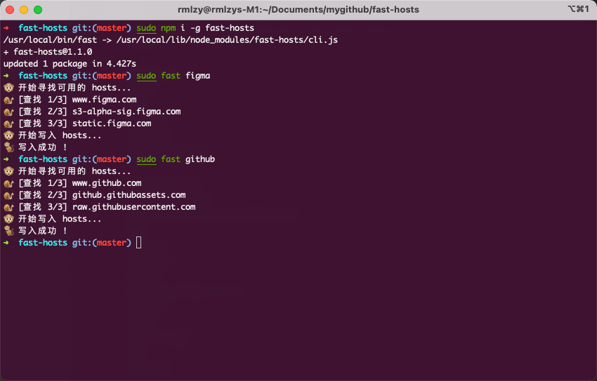

此工具用于自动寻找访问速度最快的 IP，并写入系统的 hosts 文件中。

## 安装

```bash
$ npm i -g fast-hosts

# or
$ yarn global add fast-hosts
```

## 预览



## 如何使用

由于要操作 `/etc/hosts` 文件, 所以需要 sudo 权限

```bash
# 一键加速 Github
$ sudo fast github

# 一键加速 Figma
$ sudo fast figma
```

```bash
# 清空 Github 配置
$ sudo fast clear github

# 清空 Figma 配置
$ sudo fast clear figma
```

核心代码来自 [Figma-Net-OK](https://github.com/Moonvy/Figma-Net-OK)

## License
MIT
